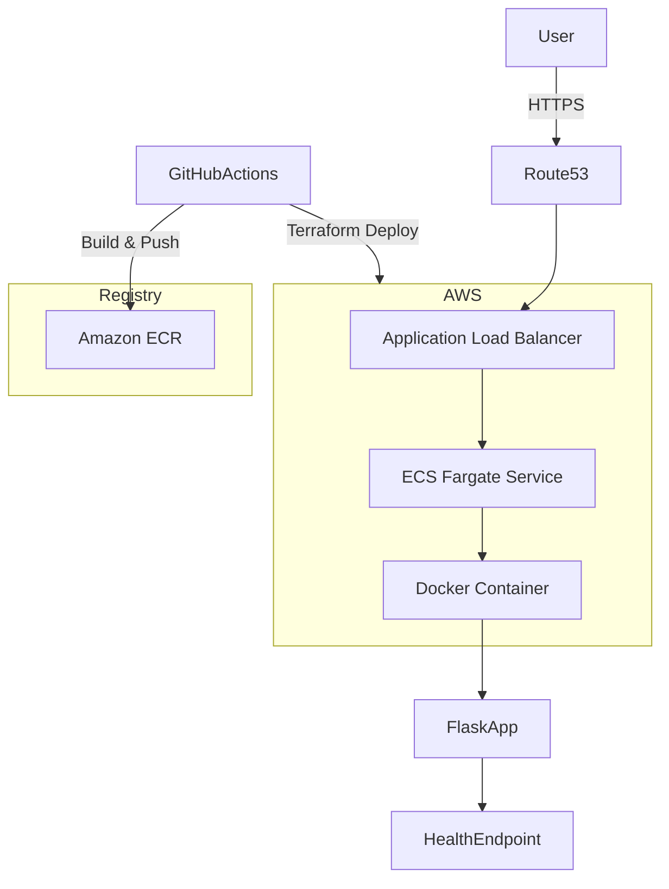

# The-AWS-ECS-Project

# ThreatMod ECS Deployment Project

## Overview

This project demonstrates a **production-style container deployment pipeline on AWS** using modern DevOps practices.

The objective was to design, containerise, deploy, and automate a cloud application using:

* **Docker**
* **Amazon ECS (Fargate)**
* **Terraform Infrastructure as Code**
* **GitHub Actions CI/CD**
* **AWS ECR for container registry**
* **Application Load Balancer**
* **Route 53 DNS**
* **AWS Certificate Manager (HTTPS)**

The final application is publicly accessible via HTTPS:

```
https://tm.<your-domain>/health
```

The project intentionally follows the workflow used in real-world environments:

```
ClickOps → Destroy → Infrastructure as Code → Automated CI/CD
```

---

# Architecture

The application is deployed on AWS using a containerised architecture.



### Infrastructure Components

| Component      | Purpose                              |
| -------------- | ------------------------------------ |
| Route53        | Domain DNS routing                   |
| ACM            | TLS certificate management           |
| ALB            | Load balancing and HTTPS termination |
| ECS Fargate    | Container runtime                    |
| ECR            | Container image registry             |
| Terraform      | Infrastructure provisioning          |
| GitHub Actions | CI/CD pipeline                       |

---

# Tech Stack

### Cloud

* AWS ECS (Fargate)
* AWS ECR
* AWS Application Load Balancer
* AWS Route53
* AWS Certificate Manager
* AWS IAM

### Infrastructure

* Terraform
* Terraform Modules

### Application

* Python
* Flask
* Gunicorn

### Containerisation

* Docker
* Distroless runtime image
* Multi-stage builds

### CI/CD

* GitHub Actions
* OIDC authentication to AWS

---

# Application

The sample application exposes a simple health endpoint.

```
GET /health
```

Response:

```json
{
  "status": "ok"
}
```

---

# Project Structure

```
.
├── app/                     # Application source code
│   ├── main.py
│   └── requirements.txt
│
├── Dockerfile               # Multi-stage container build
├── .dockerignore
├── .gitignore
│
├── infra/                   # Terraform infrastructure
│   ├── provider.tf
│   ├── main.tf
│   ├── variables.tf
│   ├── outputs.tf
│   └── modules/
│       ├── vpc/
│       ├── ecs/
│       ├── alb/
│       ├── ecr/
│       └── acm/
│
├── .github/
│   └── workflows/
│       └── deploy.yml       # CI/CD pipeline
│
└── README.md
```

---

# Docker

The application is containerised using a **multi-stage Docker build**.

Key features:

* Small runtime footprint
* Non-root user
* Distroless runtime image
* Layer caching for faster builds

Build locally:

```bash
docker build -t threatmod .
```

Run locally:

```bash
docker run -p 80:80 threatmod
```

Test:

```bash
curl http://localhost/health
```

Expected output:

```
{"status":"ok"}
```

---

# Container Registry (ECR)

The container image is stored in **Amazon Elastic Container Registry**.

Example image:

```
<account-id>.dkr.ecr.eu-west-2.amazonaws.com/threatmod:<commit-sha>
```

Images are automatically pushed via CI/CD.

---

# Infrastructure as Code (Terraform)

All AWS resources are provisioned using **Terraform modules**.

### Core resources

* VPC
* Public Subnets
* Internet Gateway
* ECS Cluster
* ECS Service (Fargate)
* ECR Repository
* Application Load Balancer
* Target Groups
* HTTPS Listener
* Route53 DNS Record
* ACM TLS Certificate
* IAM Roles and Policies

Deploy infrastructure manually:

```bash
cd infra

terraform init
terraform plan
terraform apply
```

---

# CI/CD Pipeline

The CI/CD pipeline is implemented using **GitHub Actions**.

Pipeline stages:

### 1. Build

* Build Docker image
* Tag image using Git commit SHA

### 2. Push

* Authenticate to AWS via OIDC
* Push image to ECR

### 3. Deploy

* Terraform init
* Terraform plan
* Terraform apply

### 4. Health Check

Verify deployment:

```
curl https://tm.<your-domain>/health
```

If the health check fails, the pipeline fails.

---

# Security

Best practices implemented:

* OIDC authentication (no static AWS keys)
* IAM least privilege roles
* HTTPS enforced via ALB
* Non-root container user
* Minimal runtime container image

---

# HTTPS Configuration

TLS certificates are managed using **AWS Certificate Manager**.

Steps:

1. Request ACM certificate
2. Validate via DNS in Route53
3. Attach certificate to ALB HTTPS listener
4. Redirect HTTP → HTTPS

Final endpoint:

```
https://tm.<your-domain>
```

---

# Verification

Test the deployment:

```bash
curl https://tm.<your-domain>/health
```

Expected response:

```json
{
  "status": "ok"
}
```

---

# Screenshots

### Successful ECS Deployment

*(Insert screenshot here)*

---

### GitHub Actions Pipeline Success

*(Insert screenshot here)*

---

### Application Running on Domain

*(Insert screenshot here)*

---

# Reproducing the Project

### 1. Clone repository

```
git clone https://github.com/<yourusername>/threatmod-project
cd threatmod-project
```

---

### 2. Configure AWS

Ensure AWS CLI is configured.

```
aws configure
```

---

### 3. Deploy Infrastructure

```
cd infra

terraform init
terraform apply
```

---

### 4. Build and Push Image

```
docker build -t threatmod .

docker push <ecr-repository>
```

---

### 5. Verify Deployment

```
curl https://tm.<your-domain>/health
```

---

# Lessons Learned

This project demonstrates the full **DevOps lifecycle**:

* Containerisation
* Infrastructure as Code
* Cloud networking
* Load balancing
* TLS certificates
* CI/CD automation
* Secure AWS authentication

The workflow mirrors **real production deployments used in modern DevOps teams**.

---

# Future Improvements

Possible enhancements:

* Blue/Green ECS deployments
* Terraform remote state (S3 + DynamoDB)
* Autoscaling policies
* Observability with CloudWatch
* Container vulnerability scanning
* Slack notifications for deployments

---


