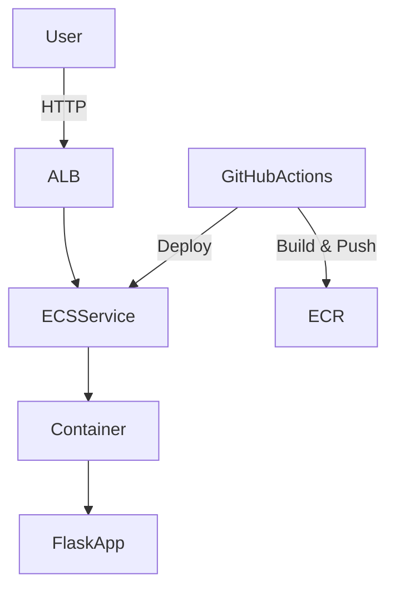
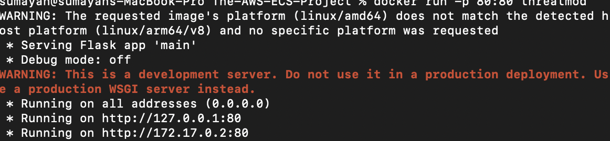
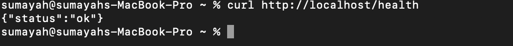
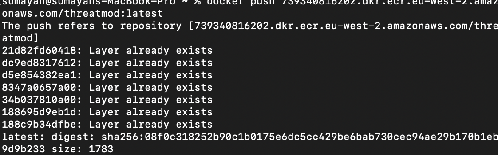
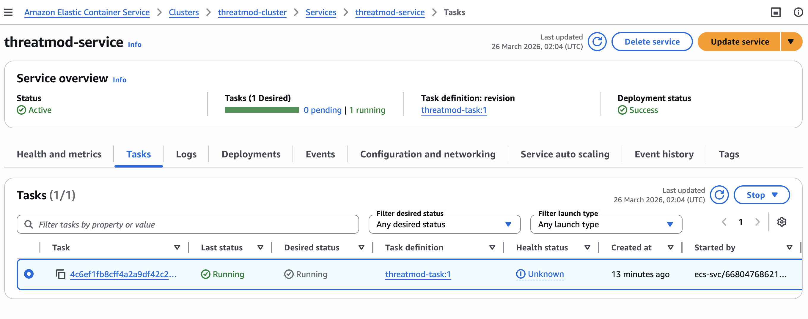
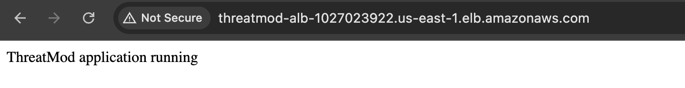
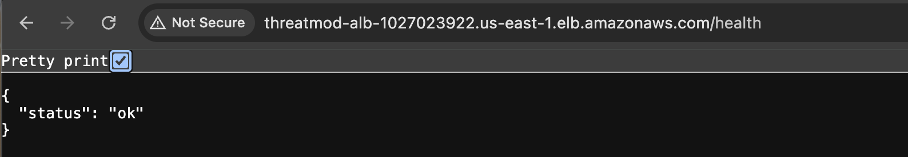

# 🚀 The AWS ECS Project — ThreatMod Deployment


---

## 📌 Overview

This project demonstrates a **production-style container deployment pipeline on AWS** using modern DevOps practices.

It follows a real-world workflow:

```
Local Development → Docker → AWS ECR → ECS (Fargate) → Load Balancer → Live Application
```

The application is:

- Containerised using Docker  
- Pushed to AWS ECR  
- Deployed on ECS Fargate  
- Exposed via an Application Load Balancer  

---

## 🌍 Live Demo

Application is publicly accessible:

http://threatmod-alb-1027023922.us-east-1.elb.amazonaws.com/health

Response:

```json
{"status":"ok"}
```

---

## 🧠 What This Project Demonstrates

- Docker containerisation  
- AWS ECR (image registry)  
- ECS Fargate deployments  
- Load balancing with ALB  
- Debugging real-world issues (ARM vs x86)  
- End-to-end DevOps workflow  

---

## 🏗 Architecture



---

## ⚙️ Tech Stack

### ☁️ Cloud
- AWS ECS (Fargate)
- AWS ECR
- AWS Application Load Balancer

### 🛠 DevOps
- Docker
- Terraform (planned)
- GitHub Actions (planned)

### 💻 Application
- Python
- Flask

---

## 🧪 Step 1 — Application Setup

### Run Locally

```bash
python3 app/main.py
```

### Test

```bash
curl http://localhost/health
```

---

## 🐳 Step 2 — Containerisation (Docker)

### Build Image

```bash
docker build -t threatmod .
```

### Run Container

```bash
docker run -p 80:80 threatmod
```

### Test

```bash
curl http://localhost/health
```

---

## 📦 Step 3 — Container Registry (ECR)

### Create Repository

```bash
aws ecr create-repository --repository-name threatmod --region eu-west-2
```

### Push Image

```bash
docker push <account-id>.dkr.ecr.eu-west-2.amazonaws.com/threatmod:latest
```

---

## ☁️ Step 4 — ECS Deployment (Fargate)

- Created ECS Cluster  
- Defined Task Definition using ECR image  
- Created ECS Service  
- Attached Application Load Balancer  
- Deployed container successfully  

---

## 📸 Project Screenshots

### 🐳 Local Docker Run


---

### 🧪 Local Health Check


---

### 📦 Image Pushed to AWS ECR


---

### ☁️ ECS Running Task


---

### 🌍 Application via Load Balancer


---

### ✅ Health Endpoint via ALB


---

## 📊 Project Progress

| Stage | Status |
|------|--------|
| Application | ✅ Complete |
| Docker | ✅ Complete |
| ECR | ✅ Complete |
| ECS Deployment | ✅ Complete |
| Terraform | ⏳ Next |
| CI/CD | ⏳ |

---

## 🚀 Next Steps

### Step 5 — Terraform
- Rebuild infrastructure using Infrastructure as Code  

### Step 6 — CI/CD
- Automate builds and deployments using GitHub Actions  

### Step 7 — HTTPS + Domain
- Route53 + ACM setup  

---

## 📂 Project Structure

```
.
├── app/
├── Dockerfile
├── docs/images/
├── infra/
├── .github/workflows/
└── README.md
```

---

## 🔐 Security

- IAM least privilege  
- Secure AWS CLI authentication  
- Container isolation  

---

## 📘 Key Learnings

- Containerisation with Docker  
- AWS ECR image management  
- ECS Fargate deployment workflow  
- Load balancing with ALB  
- Debugging architecture issues (ARM vs x86)  
- End-to-end DevOps pipeline  

---

## 🏆 Summary

This project demonstrates a complete **cloud-native deployment pipeline**:

```
Local Development → Docker → ECR → ECS → Load Balancer → Live Application
```

---

## 🚀 Future Improvements

- Terraform (Infrastructure as Code)  
- CI/CD automation  
- HTTPS with ACM + Route53  
- Auto-scaling ECS service  
- Monitoring with CloudWatch  

---

## 👤 Author

Sumayah