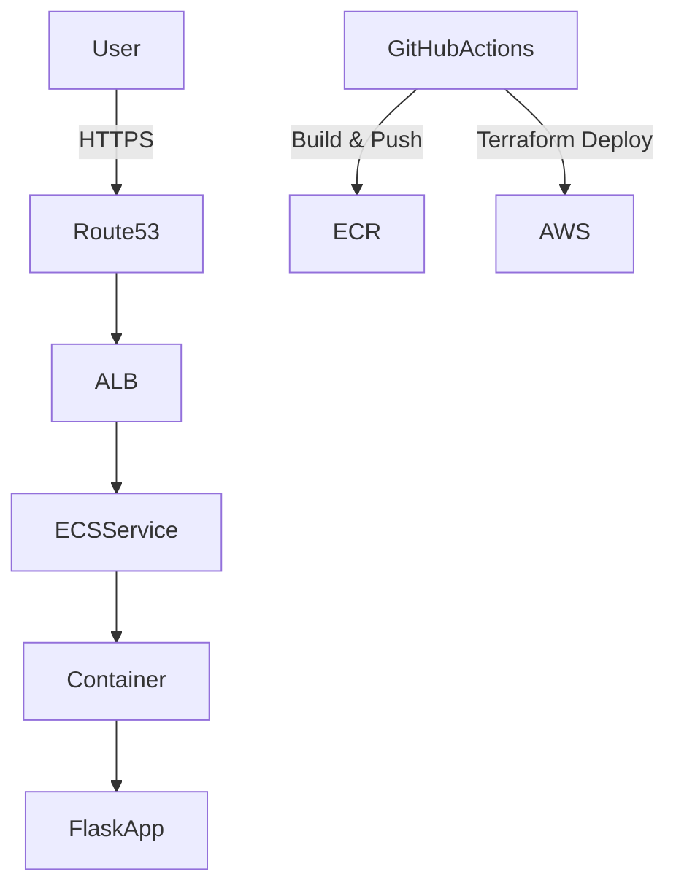
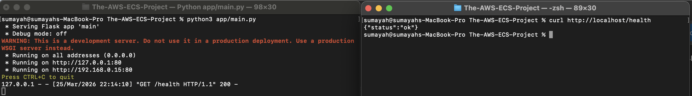
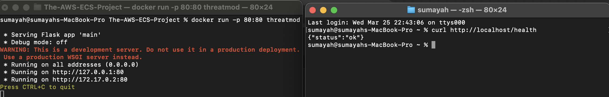
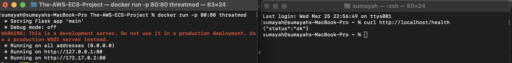
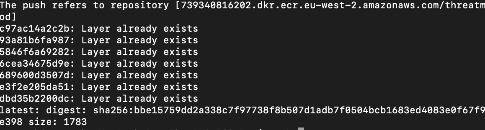

# 🚀 The AWS ECS Project — ThreatMod Deployment


---

## 📌 Overview

This project demonstrates a **production-style container deployment pipeline on AWS**.

It follows a real-world DevOps workflow:

```
Local App → Docker → AWS ECR → ECS → Terraform → CI/CD
```

### ✅ Current Progress

- Application built and tested locally  
- Containerised with Docker  
- Image pushed to AWS ECR  

---

## 🧠 What This Project Demonstrates

- Docker containerisation  
- AWS ECR (image registry)  
- AWS CLI authentication  
- Real DevOps workflow  
- Debugging & environment setup  

---

## 🏗 Architecture



---

## ⚙️ Tech Stack

**Cloud**
- AWS ECS (Fargate)
- AWS ECR
- AWS ALB
- AWS Route53
- AWS ACM

**DevOps**
- Docker
- Terraform
- GitHub Actions

**Application**
- Python
- Flask
- Gunicorn

---

# 🧪 Step 1 — Application Setup

### Run Locally

```bash
python3 app/main.py
```

### Test

```bash
curl http://localhost/health
```

### Output

```json
{"status":"ok"}
```

---

# 🐳 Step 2 — Containerisation (Docker)

### Build Image

```bash
docker build -t threatmod .
```

### Run Container

```bash
docker run -p 80:80 threatmod
```

### Test

```bash
curl http://localhost/health
```

---

# 📦 Step 3 — Container Registry (ECR)

### Create Repository

```bash
aws ecr create-repository --repository-name threatmod --region eu-west-2
```

### Push Image

```bash
docker push <account-id>.dkr.ecr.eu-west-2.amazonaws.com/threatmod:latest
```

---

# 📸 Project Screenshots

## 🧪 Application Running Locally

<p align="center">
  
</p>

---

## 🐳 Docker Container Running

<p align="center">
  
</p>

---

## ✅ Docker Health Check

<p align="center">
  
</p>

---

## 📦 Image Pushed to AWS ECR

<p align="center">
  
</p>

---

# 📊 Project Progress

| Stage | Status |
|------|--------|
| Application | ✅ Complete |
| Docker | ✅ Complete |
| ECR | ✅ Complete |
| ECS Deployment | ⏳ Next |
| Terraform | ⏳ |
| CI/CD | ⏳ |

---

# 🚀 Next Steps

### Step 4 — ECS Deployment (ClickOps)
- ECS Cluster
- Task Definition
- Fargate Service
- Load Balancer

### Step 5 — Terraform
- Rebuild infrastructure as code

### Step 6 — CI/CD
- Automate deployments using GitHub Actions

### Step 7 — HTTPS + Domain
- Route53 + ACM setup

---

# 📂 Project Structure

```
.
├── app/
├── Dockerfile
├── docs/
├── infra/
├── .github/workflows/
└── README.md
```

---

# 🔐 Security

- IAM least privilege
- Secure AWS CLI authentication
- Container isolation

---

# 📘 Key Learnings

- End-to-end container workflow  
- Cloud image registry (ECR)  
- Debugging real DevOps issues  
- CLI-based AWS interaction  

---

# 🚀 Future Improvements

- Blue/Green deployments  
- Auto scaling  
- CloudWatch monitoring  
- Terraform remote state  

---


GitHub: https://github.com/<yourusername>